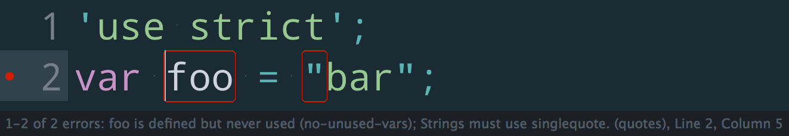

# SublimeLinter-contrib-xo



This linter plugin for [SublimeLinter](https://github.com/SublimeLinter/SublimeLinter) provides an interface to [XO](https://github.com/xojs/xo). It will be used with files that have the “JavaScript” syntax.


## Installation

SublimeLinter must be installed in order to use this plugin.

Please use [Package Control](https://packagecontrol.io) to install the linter plugin.

Before installing this plugin, you must ensure that `xo` is installed on your system:

```
$ npm install --global xo
```

In order for `xo` to be executed by SublimeLinter, you must ensure that its path is available to SublimeLinter. The docs cover [troubleshooting PATH configuration](http://sublimelinter.readthedocs.io/en/latest/troubleshooting.html#finding-a-linter-executable).


## Settings

- [SublimeLinter settings](http://sublimelinter.readthedocs.org/en/latest/settings.html)
- [Linter settings](http://sublimelinter.readthedocs.org/en/latest/linter_settings.html)


## Note

XO linting is only enabled for projects with `xo` in `devDependencies`/`dependencies` in package.json.


## License

MIT © [Sindre Sorhus](https://sindresorhus.com)
